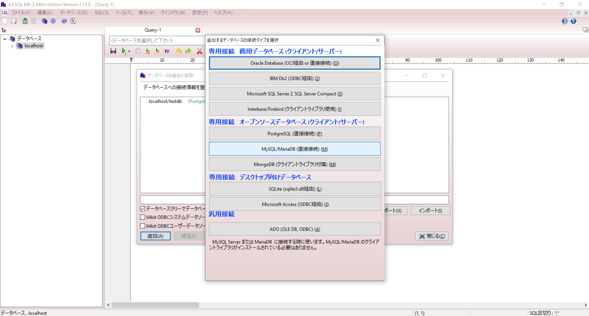
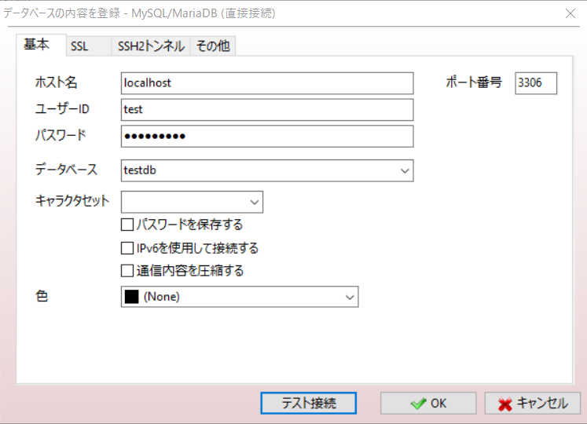
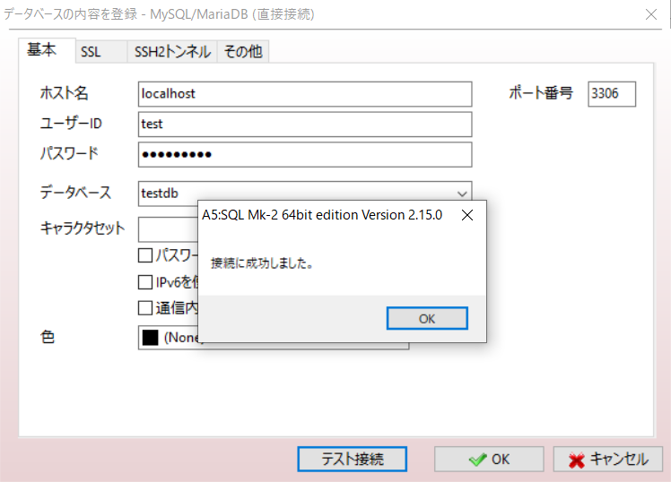
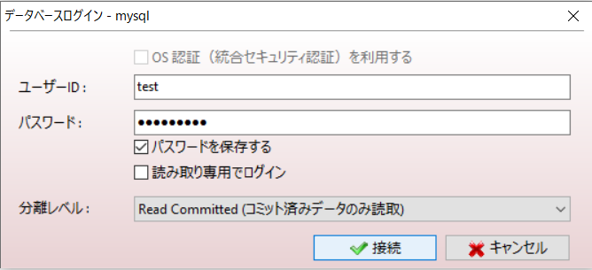
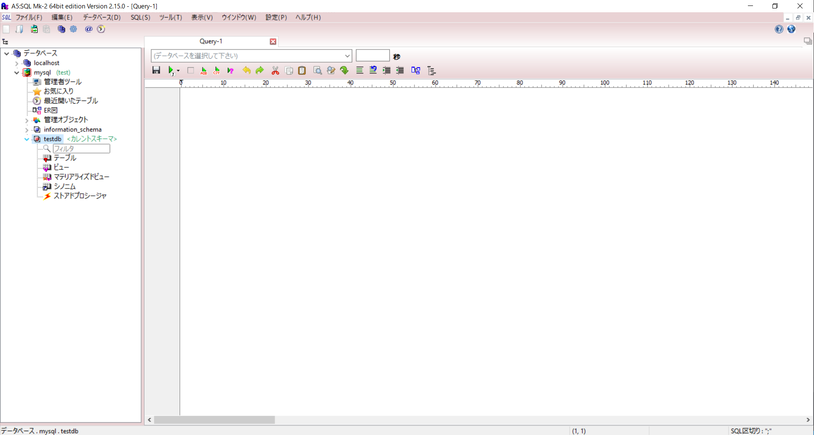

# 接続方法まとめ
## Windows
1. A5:mk-2を起動する。  
   データベースの追加からMySQL/MariaDBを選択する。
   

2. 接続設定の画面が表示されるので、Dockerの設定情報に合わせて設定を行う。  
   今回のSCでは、設定ユーザーで接続を行う想定。この時、データベースの設定を忘れると次のテスト接続で失敗するので注意。  
   ROOT以外のユーザーで接続を行う場合、原則として下記の設定がコンテナにされていること。

     - MYSQL_DATABASE=testdb
     - MYSQL_USER=test
     - MYSQL_PASSWORD=test_pass  
  
   ROOT以外のユーザーはMYSQL_DATABASEに設定されたDBにのみ、アクセス権をもっているので、これを設定しないとテスト接続できない。  
   

3. テスト接続を行い、設定情報に誤りがないことを確認する。  
   設定情報が正しければ、下記のポップアップが出現する。
   

4. 最後に実際にDBへ接続を行う。  
   先ほどと同様に設定情報を入れて、接続を行う。  
     
   
   接続に成功すると、サイドメニューのTreeViewに構造が表示される。
   
