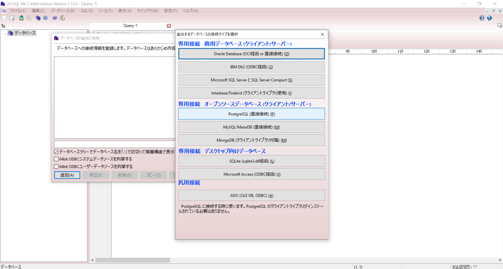
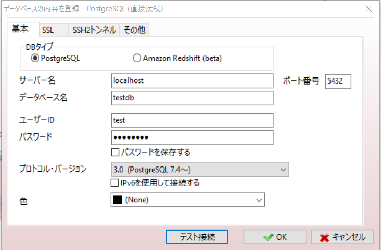
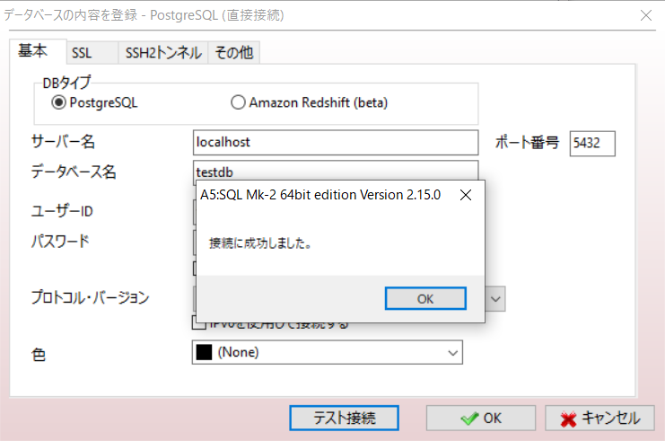
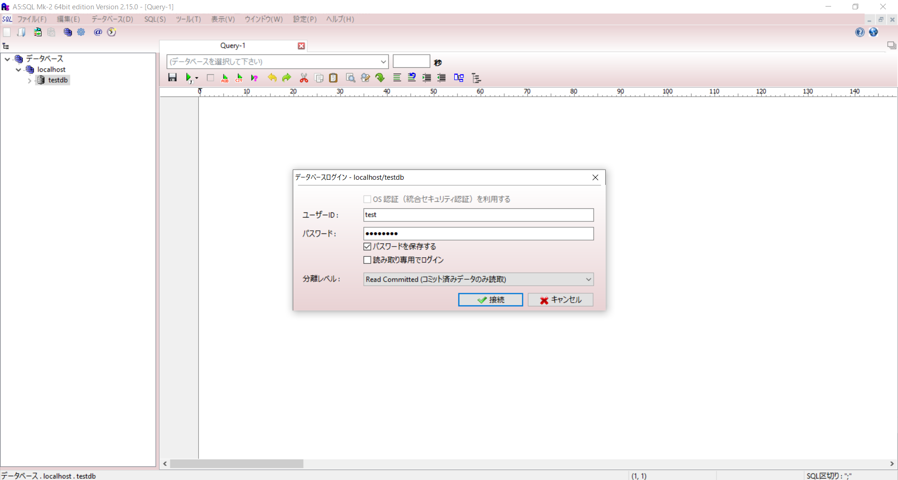
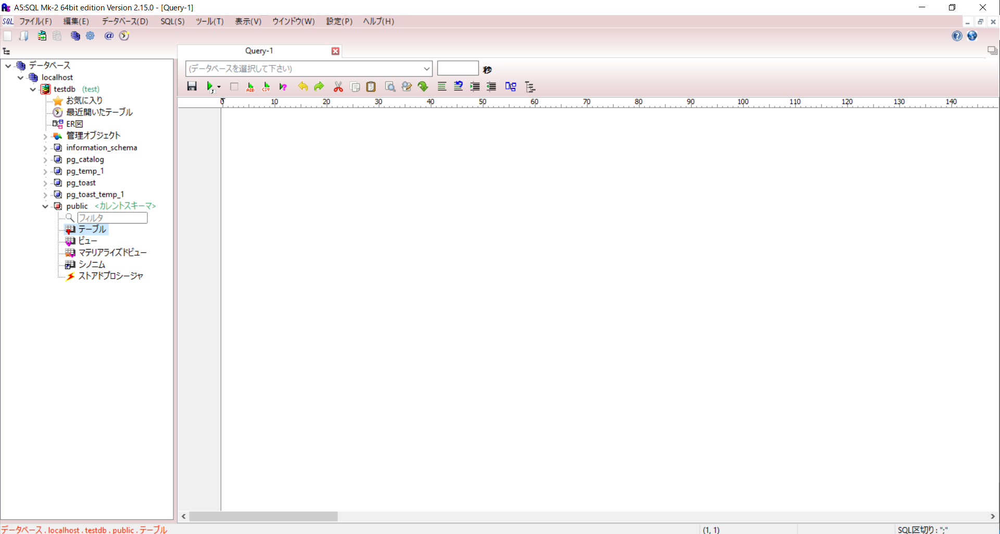

# 接続方法まとめ
## Windows
### A5:mk-2
1. A5:mk-2を起動する。  
   データベースの追加からPostgreSQLを選択する。
   

2. 接続設定の画面が表示されるので、Dockerの設定情報に合わせて設定を行う。
   

3. テスト接続を行い、設定情報に誤りがないことを確認する。  
   設定情報が正しければ、下記のポップアップが出現する。
   

4. 最後に実際にDBへ接続を行う。  
   先ほどと同様に設定情報を入れて、接続を行う。
     
   
   接続に成功すると、サイドメニューのTreeViewに構造が表示される。
   
